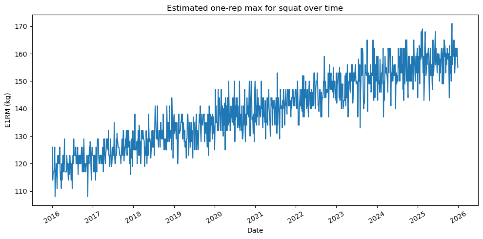
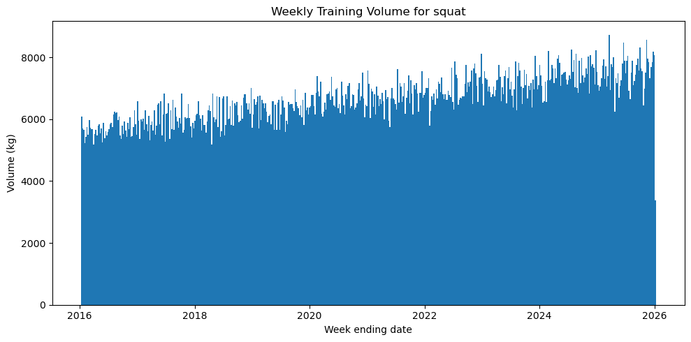

# Training Analytics
A Python-based analytics pipeline that processes training data to generate insights on strength progression, training volume, and performance trends over time.

## Overview
This project:
- Ingests and processes strength training data (synthetic for privacy)
- Builds a standardised analysis dataset from multiple sources
- Computes estimated one-rep max (e1RM) progression
- Calculates weekly training volume
- Visualises performance trends over time
## Key Features
- Estimated one-rep max progression by exercise
- Weekly training volume analysis
- Time-series visualisation of training volume
- Multi-source data merging (biometrics and training data from CSV and XLSX files)
## Example Outputs

### Estimated 1RM Progression


### Weekly Training Volume

## Tech Stack
- Python
- Pandas
- Matplotlib
- OpenPyXL
- NumPy
## Project Structure
```bash
├── data/
│   └── synthetic/
├── figures/
├── notebooks/
│   ├── analytics.ipynb
│   ├── generate_mock_data.ipynb
│   └── test_load_data.ipynb
├── src/
│   └── data_ETL_functions.py
├── .gitignore
└── README.md
```
## Data
This project uses synthetic training data generated to simulate realistic strength progression and ensure privacy and reproducibility.
## Highlights
- Built an end-to-end analytics pipeline from raw data to insight
- Implemented time-based aggregation and feature engineering
- Designed reusable plotting functions for exploratory analysis
- Integrated a realistic multi-source dataset
## Future Improvements
- Bodyweight and biometric trend analysis
- Interactive dashboard
- Automated reporting
## Status
Currently under active development.
